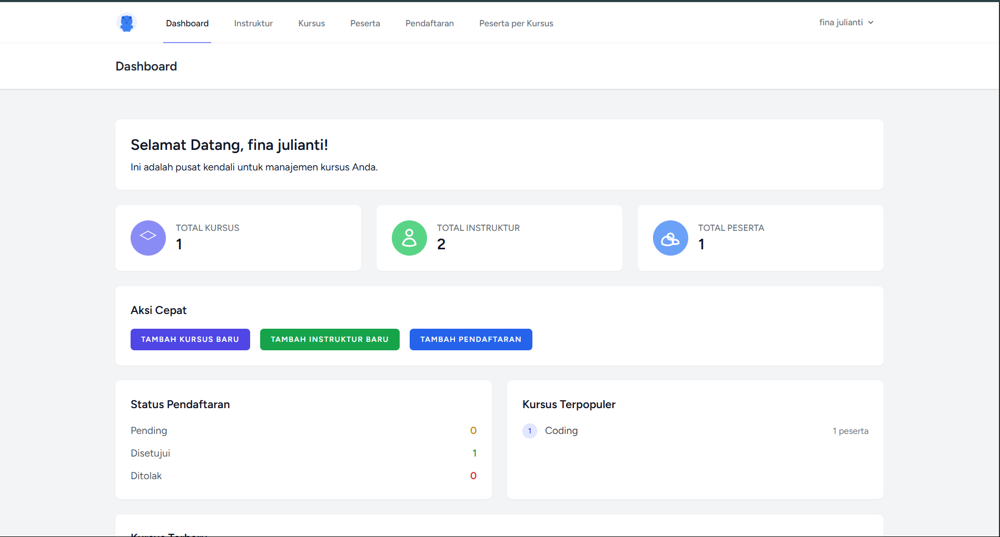
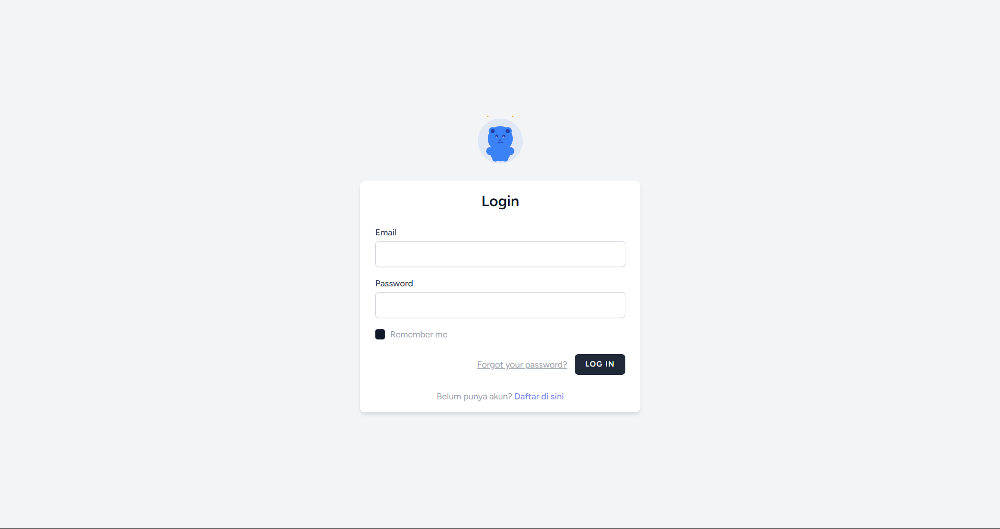

# Sistem Manajemen Kursus

**Sistem Manajemen Kursus** yang dibangun menggunakan **Laravel 12** dan **Livewire** untuk mengelola data kursus, instruktur, peserta, dan pendaftaran.

## 📋 Deskripsi

Website ini adalah aplikasi web yang dirancang untuk memudahkan pengelolaan sistem kursus dengan fitur lengkap mulai dari manajemen instruktur, kursus, peserta, hingga sistem pendaftaran dengan validasi yang ketat.

## 📸 Screenshots

### Dashboard

*Dashboard utama dengan overview sistem manajemen kursus*

### Login Page

*Halaman login dengan form autentikasi*

## 🛠️ Teknologi yang Digunakan

- **Framework:** Laravel 12
- **Full-Stack:** Livewire
- **Database:** MySQL
- **Frontend:** Tailwind CSS, Blade Template Engine
- **File Upload:** Laravel File System
- **Authentication:** Laravel Breeze
- **Language:** PHP 8.2

## ✨ Fitur Utama

- **Dashboard Admin** - Panel kontrol utama
- **Manajemen Instruktur** - CRUD lengkap
- **Manajemen Kursus** - CRUD dengan relasi instruktur
- **Manajemen Peserta** - Data peserta kursus
- **Sistem Pendaftaran** - Pendaftaran kursus dengan validasi
- **Manajemen Materi** - Upload dan kelola materi per kursus
- **Profile Management** - Edit profil user
- **Validasi Data** - Mencegah duplikasi pendaftaran
- **Responsive Design** - Tampilan responsif dengan Tailwind CSS
- **Jumlah Peserta per Kursus** - Statistik pendaftaran

## 🗄️ Struktur Database

### Tabel Utama:
- **users** - Data pengguna/admin
- **instrukturs** - Data instruktur kursus
- **kursuses** - Data kursus yang tersedia
- **pesertas** - Data peserta kursus
- **pendaftarans** - Data pendaftaran kursus
- **materis** - Data materi per kursus

### Relasi:
- Kursus → belongsTo Instruktur
- Pendaftaran → belongsTo Kursus & Peserta
- Materi → belongsTo Kursus

## 🚀 Instalasi & Setup

### Prerequisites
- PHP 8.2+
- Composer
- MySQL Database
- Node.js & npm

### Langkah Instalasi

1. **Clone Repository**
   ```bash
   git clone https://github.com/finadio/kursus_Laravel_H1D023119.git
   cd kursus_Laravel_H1D023119
   ```

2. **Install Dependencies**
   ```bash
   composer install
   npm install
   ```

3. **Setup Environment**
   ```bash
   cp .env.example .env
   ```
   
   Edit file `.env` dan sesuaikan konfigurasi database:
   ```env
   DB_HOST=localhost
   DB_PORT=3306
   DB_DATABASE=kursus_management
   DB_USERNAME=root
   DB_PASSWORD=
   ```

4. **Generate APP_KEY**
   ```bash
   php artisan key:generate
   ```

5. **Setup Database**
   ```bash
   php artisan migrate
   ```

6. **Build Assets**
   ```bash
   npm run build
   ```

7. **Jalankan Aplikasi**
   ```bash
   php artisan serve
   ```

8. **Akses Aplikasi**
   Buka browser dan akses: `http://localhost:8000`

## 📁 Struktur Project

```
kursus-management/
├── app/
│   ├── Livewire/       # Livewire components
│   ├── Models/         # Database models
│   └── Http/           # Controllers
├── database/
│   └── migrations/     # Database migrations
├── resources/
│   └── views/          # Blade templates
├── public/
│   └── build/          # Compiled assets
├── screenshots/        # Screenshots aplikasi
├── config/             # Configuration files
└── routes/             # Route definitions
```

## 🎯 Demo Fitur

1. **Dashboard** - Overview sistem
2. **Instruktur** - Tambah, edit, hapus instruktur
3. **Kursus** - Kelola kursus dengan relasi instruktur
4. **Peserta** - Manajemen data peserta
5. **Pendaftaran** - Sistem pendaftaran dengan validasi
6. **Materi** - Upload dan kelola materi per kursus
7. **Profile** - Edit profil pengguna

## 👨‍💻 Developer

**Nama:** Fina Julianti  
**NIM:** H1D023119  
**Kelas:** Pemrograman Web II B

## 📝 License

Project ini dibuat untuk memenuhi tugas mata kuliah **Pemrograman Web II B**.

## 🤝 Contributing

1. Fork project ini
2. Buat branch baru (`git checkout -b feature/AmazingFeature`)
3. Commit perubahan (`git commit -m 'Add some AmazingFeature'`)
4. Push ke branch (`git push origin feature/AmazingFeature`)
5. Buat Pull Request

---

**© 2024 Fina Julianti - H1D023119**
